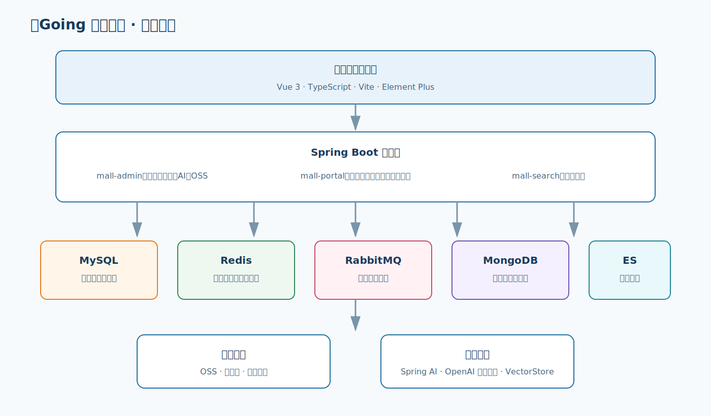

# 易Going 商城平台

易Going 是一个前后端分离的商城实践项目，包含运营后台、会员门户、商品搜索和智能客服原型。项目以真实电商业务链路为主线，覆盖商品管理、购物车、下单、库存锁定、优惠券、订单超时取消、权限管理与运营配置等能力。

> 项目仍在持续完善。支付模块已完成安全收口、环境变量配置和渠道抽象；接入支付宝、微信支付真实交易前，需要配置商户证书、密钥和公网回调地址。

## 项目亮点

- **现代化技术栈**：后端升级至 Java 21 与 Spring Boot 3.5；管理端使用 Vue 3、TypeScript、Vite、Element Plus。
- **完整交易骨架**：购物车确认、优惠计算、库存锁定、订单生成、延迟取消、库存释放均已具备。
- **安全基础**：JWT 无状态认证、方法级权限控制、BCrypt 密码编码、Redis IP 限流、生产环境密钥外置。
- **AI 客服原型**：基于 Spring AI 的检索增强问答链路，支持 OpenAI 兼容模型配置、向量检索和来源回传。
- **可运维性**：OpenAPI 文档、Actuator 健康检查、统一环境变量模板、PowerShell 一键启动脚本。

## 技术架构



### 架构与开发流程参考

<p align="center">
  
  
</p>

<p align="center">
  
</p>

<p align="center">
  
</p>

### 后端技术

| 分类 | 技术 |
| --- | --- |
| 基础框架 | Java 21、Spring Boot 3.5、Spring MVC、Spring AOP |
| 安全 | Spring Security、JWT、BCrypt、方法级 `@PreAuthorize` |
| 数据访问 | MyBatis、MyBatis Generator、PageHelper、MySQL、Druid |
| 中间件 | Redis、RabbitMQ、MongoDB、Elasticsearch 7.17 |
| AI | Spring AI、OpenAI 兼容接口、ChatClient、VectorStore |
| 运维 | Actuator、Springdoc OpenAPI、Logback、Docker（部署基础） |

### 前端技术

Vue 3、TypeScript、Vite、Vue Router、Pinia、Element Plus、Axios、ECharts、TinyMCE。

## 业务能力

### 运营后台 `mall-admin`

- 商品中心：分类、品牌、属性、SKU 库存、商品新增与编辑。
- 订单中心：订单查询、发货、售后申请、退货原因与订单设置。
- 营销中心：秒杀、优惠券、首页品牌/新品/人气商品/广告配置。
- 权限中心：管理员、角色、菜单、资源与接口级授权。
- 内容与媒体：专题、优选、OSS 上传策略。
- 智能客服：客服试聊界面与基于知识库检索的受控回答原型。

### 会员门户 `mall-portal`

- 会员注册、登录、地址管理。
- 购物车、确认订单、优惠券、积分抵扣与促销金额计算。
- 订单创建、SKU 锁库存、订单号生成、订单超时取消与库存释放。
- 关注品牌、收藏商品、浏览历史等会员行为数据。
- 订单退货申请。

### 商品搜索 `mall-search`

- 商品索引导入、全文关键词检索。
- 品牌、分类和属性聚合筛选。
- 新品、销量、价格等排序能力。

## 项目演示

<p align="center">
  
  
</p>

## 业务功能图

### 商品、订单与营销

<p align="center">
  
  
  
</p>

### 内容、会员与门户

<p align="center">
  
  
  
</p>

## 订单与支付流程

```text
购物车
  │
  ├─ 确认商品、地址、优惠券、积分
  ├─ 校验可用库存
  ├─ 创建待支付订单 + 锁定 SKU 库存
  ├─ 发送 RabbitMQ 延迟取消消息
  │
  ├─ 支付渠道创建交易（支付宝 Page Pay / 微信 Native）
  │      └─ 验签回调、金额校验、幂等更新（接入商户凭据后启用）
  │
  └─ 支付成功：订单转待发货、扣减真实库存

超时未支付
  └─ 订单关闭、释放锁定库存、返还优惠券与积分
```

为避免浏览器伪造支付结果，生产环境默认关闭 `/order/paySuccess` 的手工确认；本地沙箱调试可设置 `EASYGOING_PAYMENT_ALLOW_MANUAL_CONFIRMATION=true`。

## 目录结构

```text
mall/
├── mall-admin/             # 运营后台服务
├── mall-portal/            # 会员门户与交易服务
├── mall-search/            # 商品搜索服务
├── mall-admin-web/         # Vue 3 运营管理前端
├── mall-common/            # 通用返回、异常、工具类
├── mall-mbg/               # MyBatis Generator 生成的模型与 Mapper
├── mall-demo/              # 示例模块
├── document/
│   ├── sql/mall.sql        # 初始化数据库脚本
│   └── reference/          # 部署、支付等说明文档
├── .env.example            # 外部服务与密钥模板
└── pom.xml                 # Maven 聚合工程
```

前端工程 `mall-admin-web/` 已与后端源码一并纳入本仓库。

## 快速开始

### 1. 前置条件

- JDK 21
- Node.js 20+
- MySQL 8（导入 `document/sql/mall.sql`）
- Redis
- 门户完整运行还需 RabbitMQ、MongoDB；搜索服务还需 Elasticsearch 7.17。

### 2. 配置环境变量

复制 [`.env.example`](.env.example) 为本地 `.env` 或在 IDE / 部署平台设置同名环境变量。

生产环境至少应设置：

```bash
EASYGOING_JWT_SECRET=replace-with-a-random-secret
EASYGOING_DB_URL=jdbc:mysql://localhost:3306/mall?useUnicode=true&characterEncoding=utf-8&serverTimezone=Asia/Shanghai
EASYGOING_DB_USERNAME=mall_app
EASYGOING_DB_PASSWORD=replace-with-db-password
```

支付相关变量见 [支付与生产环境配置](document/reference/payment-setup.md)。

### 3. 构建后端

Windows 下可从 `mall-portal` 目录使用 Maven Wrapper 构建聚合工程：

```powershell
cd mall-portal
.\mvnw.cmd -f ..\pom.xml -pl mall-admin -am -DskipTests package
.\mvnw.cmd -f ..\pom.xml -pl mall-portal -am -DskipTests package
```

### 4. 启动服务

在仓库根目录执行：

```powershell
.\start.ps1
```

默认启动管理端和前端。也可以分别运行应用启动类：

| 服务 | 默认端口 | 文档地址 |
| --- | ---: | --- |
| `mall-admin` | 8080 | `http://localhost:8080/swagger-ui/index.html` |
| `mall-search` | 8081 | `http://localhost:8081/swagger-ui/index.html` |
| `mall-portal` | 8085 | `http://localhost:8085/swagger-ui/index.html` |
| `mall-admin-web` | 5173 | `http://localhost:5173` |

## 配置说明

### AI 客服

设置以下变量即可启用 OpenAI 兼容模型：

```bash
EASYGOING_AI_ENABLED=true
EASYGOING_AI_BASE_URL=https://api.openai.com
EASYGOING_AI_API_KEY=replace-with-api-key
EASYGOING_AI_CHAT_MODEL=gpt-4.1-mini
EASYGOING_AI_EMBEDDING_MODEL=text-embedding-3-small
```

AI 目前提供检索问答原型。知识库上传、文档解析和向量持久化仍应在接入生产模型与向量数据库后完成最终验收。

### 支付渠道

已预留支付宝 Page Pay 与微信支付 Native 的统一配置模型：

- `EASYGOING_ALIPAY_*`
- `EASYGOING_WECHAT_PAY_*`

完整字段及回调安全要求请查看 [payment-setup.md](document/reference/payment-setup.md)。上线前必须完成渠道 SDK 对接、回调验签、订单金额核验与幂等测试。

## 安全建议

- 不要提交 `.env`、支付私钥、证书、数据库密码或 AI 密钥。
- 生产环境只通过密钥管理服务或部署平台注入环境变量。
- Swagger、Actuator 与 Druid 监控页应限制为内网或运维网络访问。
- 支付结果仅以服务端验签回调为准，客户端跳转页面不应修改订单状态。
- 建议为 MySQL、Redis、RabbitMQ、MongoDB、Elasticsearch 分别创建最小权限账号。

## 当前状态与路线图

| 能力 | 状态 |
| --- | --- |
| 后台商品、订单、营销、权限 | 已具备基础实现 |
| 门户购物车、下单、锁库存、超时取消 | 已具备基础实现 |
| Redis 限流、JWT、方法级权限 | 已接入 |
| AI 客服检索问答原型 | 已接入，待生产知识库链路验收 |
| 支付渠道配置与统一抽象 | 已完成 |
| 支付宝 / 微信真实交易与回调验签 | 待接入商户资料并完成实现 |
| 自动化测试、容器编排、CI/CD | 持续完善中 |

<details>
<summary><strong>环境搭建参考图（点击展开）</strong></summary>

### IDE 导入

<p align="center">
  
  
</p>

### RabbitMQ 安装

<p align="center">
  
  
  
  
</p>

</details>

## License

本项目基于原始开源商城工程进行二次开发与现代化升级。使用前请遵守仓库内 [LICENSE](LICENSE) 及其依赖组件的许可协议。
